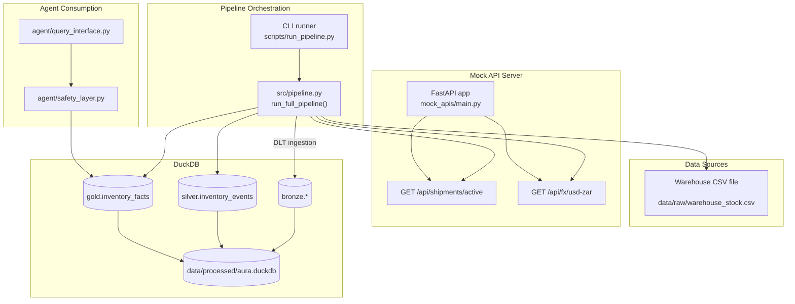

# Knowledge Engineering Data Pipeline – [AURA] Autonomous Replenishment Assistant (Recruiter Brief)

This repository is a **Knowledge Engineering Data Pipeline** built to make an autonomous agent safe in production-like conditions.

Aura is not a chatbot. Aura is an Agent-First, Autonomous Replenishment Assistant built to make safe, multi-million Rand procurement decisions for a Rustenburg platinum mine.

- **Business pain:** Conflicting warehouse vs logistics data creates “shadow stock,” driving either R2M in overstock or R10M downtime from stockouts.
- **Design stance:** Every decision (DLT ingestion, bitemporal modeling, semantic resolution, safety guardrails) exists so Aura can act safely under uncertainty.

In other words: this pipeline exists to turn raw operational data into **agent-ready knowledge** (facts + confidence + safety signals), not just move records.

---

## What the pipeline Delivers
- **Unified, trustworthy facts** from messy sources (CSV + API).
- **Shadow stock detection** when deliveries aren’t yet counted on-shelf.
- **Reliability scores and safety flags** so the agent knows when NOT to act.
- **Agent-ready outputs** with clear recommendations and confidence levels.

---

## Deloitte Rubric Compliance Matrix

| Rubric Item | How It’s Implemented | Where to Look |
|---|---|---|
| **DLT Usage** | Idempotent Bronze ingestion to DuckDB via DLT resources; controlled write modes | `src/pipeline.py` → `run_bronze_layer()` (DLT pipeline + resources)
| **Conflicting Semantics** | Semantic resolver unifies `on_shelf` vs `in_transit`, flags shadow stock, and generates human context | `src/transformations/semantic_resolver.py`
| **Late-Arriving Data** | Silver events track `event_timestamp` vs `ingestion_timestamp` (+ lateness flags) to recompute facts correctly | `src/transformations/bronze_to_silver.py` and `src/pipeline.py` → Silver section
| **Templated Extensibility** | Source template pattern; add a source in <20 lines + YAML config, no pipeline rewrites | `src/sources/base_source.py`, `src/sources/*.py`, `src/config/sources.yaml`
| **Agent-Ready Output** | Gold layer computes `effective_inventory`, `data_reliability_index`, `has_inconsistency`, `reorder_recommendation`; Safety layer enforces SAFE/WARNING/BLOCKED | `src/pipeline.py` → Gold section, `src/agent/safety_layer.py`, `src/agent/query_interface.py`

---

## One-Click Demo (Windows)
- Double‑click `run_demo.bat`.
- It will: clean DB, create `venv`, install `requirements.txt`, generate mock data, start the mock API, run the pipeline, and finally run the Aura demo queries.
- If you prefer a step-by-step view or need troubleshooting, see `RECRUITER_SETUP.md`.

Expected scenarios in console:
- **SAFE** – High-quality data, no conflict.
- **WARNING** – Shadow stock (delivered but not yet counted).
- **WARNING** – Low stock with urgent reorder.
- **SAFE/WARNING** – Out of stock with incoming shipment.

---

## Visuals & Scannability
- System Architecture (ASCII): see `README.md` → “System Architecture”.
- Shadow Stock Scenario timeline: see `README.md` → “Semantic Conflict Resolution”.
- Additional screenshots: `diagrams/screenshots/README.md`.

System Architecture (Mermaid)

Demo Output Screenshots (PNGs)

---

## Why This Is Agent-First
- **Safety guardrails first:** Freshness, reliability thresholding, and shadow-stock checks prevent bad autonomous actions.
- **Auditable knowledge:** Events (Silver) vs Facts (Gold) separate “what happened” from “what is true now.”
- **Business alignment:** Minimizes R2M–R5M overstock while protecting against R10M downtime.

---

## How To Evaluate Quickly
- Run `run_demo.bat`.
- Skim the resolver and the gold fact model:
  - `src/transformations/semantic_resolver.py`
  - `src/pipeline.py` (Gold layer table + recommendations)
- Glance at the agent boundary:
  - `src/agent/safety_layer.py`
  - `src/agent/query_interface.py`

---

Author: Seward Mupereri  
Contact: sewardrichardmupereri@gmail.com
