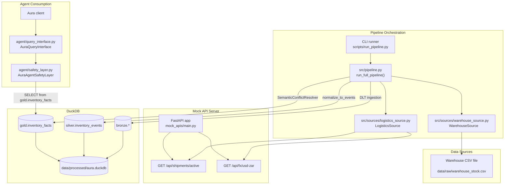
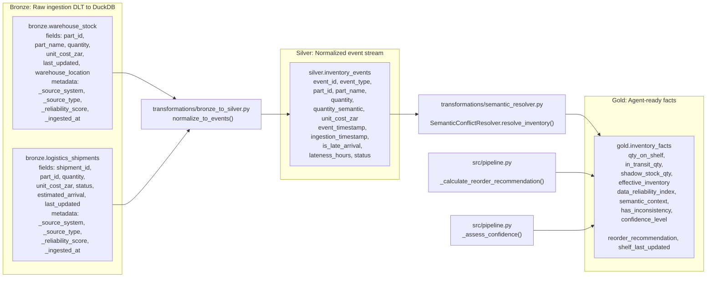
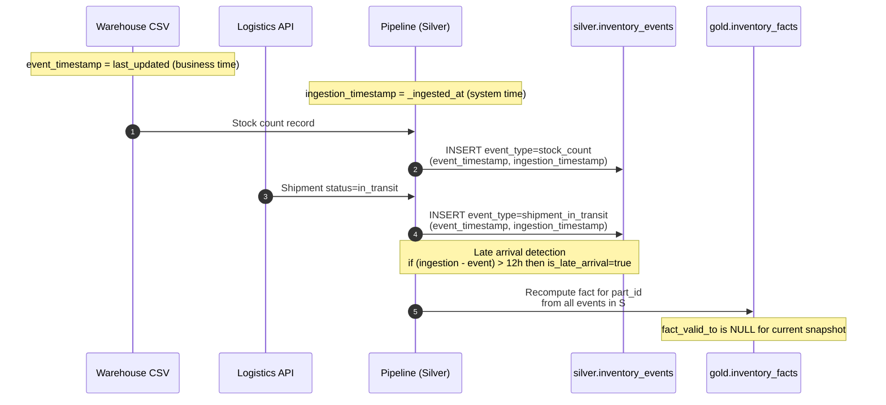
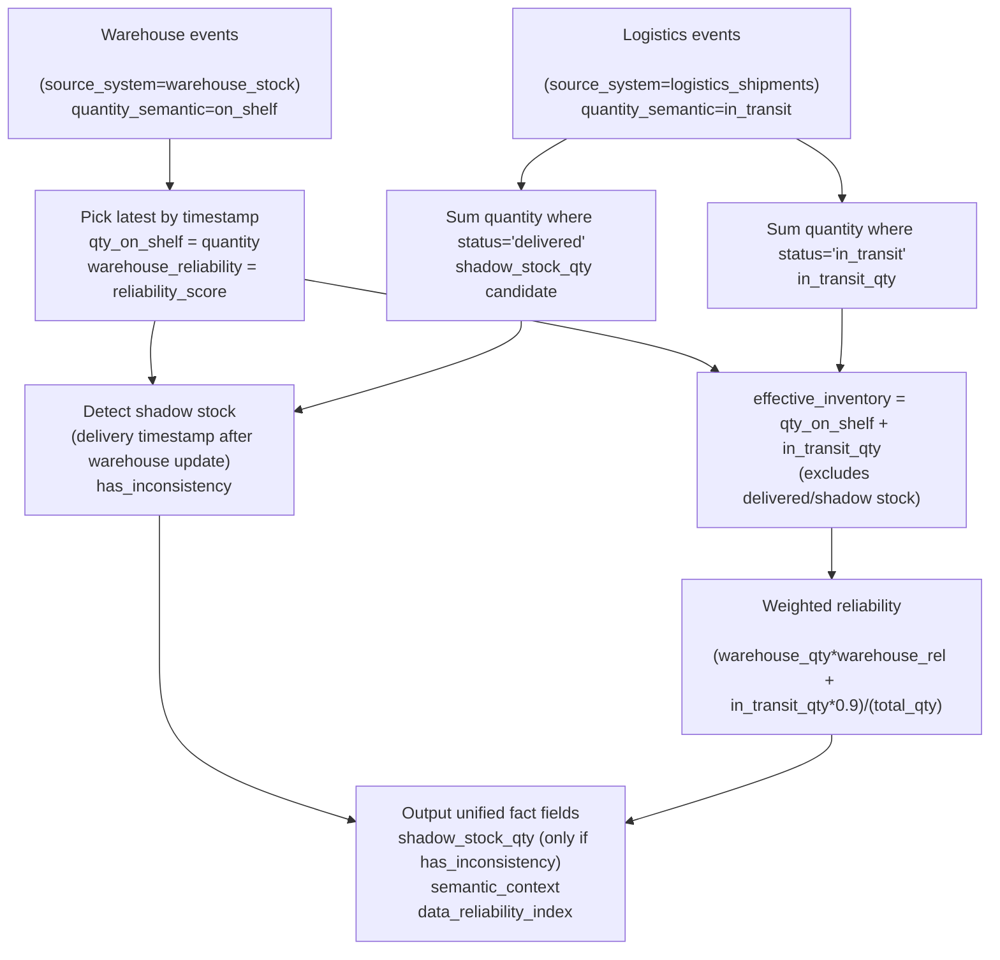
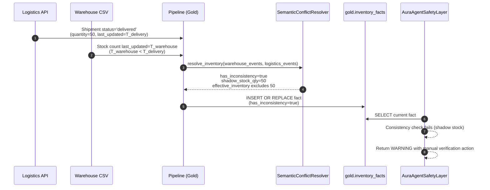
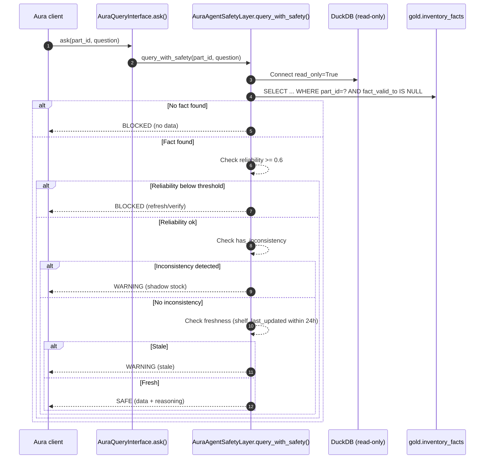

# Aura Knowledge Pipeline - Architecture Diagrams

This document contains comprehensive architecture and data flow diagrams for the Aura Knowledge Pipeline project. All diagrams are written in Mermaid.js for easy visualization and maintenance.

## 📊 Viewing the Diagrams

You can view these diagrams in several ways:

1. **GitHub** - Diagrams render automatically in GitHub's markdown viewer
2. **Mermaid Live Editor** - Copy any diagram to [mermaid.live](https://mermaid.live/) for interactive editing
3. **VS Code** - Use the Mermaid Preview extension
4. **Documentation Sites** - Most static site generators support Mermaid (GitBook, Docusaurus, MkDocs)

## 🏗️ Architecture Overview

The Aura Knowledge Pipeline implements a medallion architecture (Bronze → Silver → Gold) for inventory data processing, with built-in support for:

- **Bitemporal data tracking** (business time vs. system time)
- **Semantic conflict resolution** between data sources
- **Shadow stock detection** for delivered goods not yet reflected in warehouse counts
- **Agent safety layer** for AI query validation and consistency checks

---

## Diagram 01: System Architecture Overview

High-level view of the entire system, showing data sources, pipeline orchestration, storage layers, and agent consumption.



**Key Components:**
- **Data Sources**: CSV files and REST APIs
- **Orchestration**: Python-based pipeline using DLT for ingestion
- **Storage**: DuckDB with medallion architecture
- **Agent Layer**: Safety-checked query interface for AI consumption

---

## Diagram 02: Data Flow (Medallion Architecture)

Detailed view of the Bronze → Silver → Gold transformation pipeline and the fields at each layer.



**Layer Responsibilities:**
- **Bronze**: Raw data ingestion with metadata tracking
- **Silver**: Event normalization with temporal tracking
- **Gold**: Unified facts with conflict resolution and business logic

---

## Diagram 03: Event-to-Fact Timeline (Bitemporal Tracking)

Illustrates how events are tracked with both business time (event_timestamp) and system time (ingestion_timestamp), including late arrival detection.



**Temporal Design:**
- **Business Time**: When the event actually occurred in the real world
- **System Time**: When the pipeline ingested the event
- **Late Arrival**: Flagged when ingestion lags business time by >12 hours

---

## Diagram 04: Semantic Conflict Resolution

Shows the implemented rules for resolving conflicts between warehouse and logistics data sources.



**Resolution Logic:**
- **Warehouse**: Latest timestamp wins for on-shelf quantities
- **Logistics**: Sum in-transit shipments, detect delivered items
- **Shadow Stock**: Delivered goods arriving after last warehouse update
- **Effective Inventory**: Excludes shadow stock to prevent double-counting

---

## Diagram 05: Shadow Stock Detection Scenario

End-to-end flow showing how shadow stock is detected and handled by the safety layer.



**Shadow Stock Problem:**
When logistics shows delivered goods but warehouse counts haven't been updated yet, creating a data inconsistency that could mislead inventory calculations.

**Solution:**
The system detects this scenario, flags it, and excludes shadow stock from effective inventory until warehouse updates confirm receipt.

---

## Diagram 06: Agent Query Sequence (Safety Checks)

Complete flow of an agent query through the safety layer with all validation checks.



**Safety Checks (in order):**
1. **Data Availability**: Is there a current fact for this part?
2. **Reliability**: Does the data meet minimum quality threshold (≥0.6)?
3. **Consistency**: Are there any detected inconsistencies (shadow stock)?
4. **Freshness**: Is the warehouse data recent (<24 hours old)?

---

## 🔧 Implementation Notes

### Current Architecture

The diagrams reflect the **implemented** system as of the latest commit:

- **Pipeline Orchestration**: `src/pipeline.py` with `run_full_pipeline()`
- **Bronze Layer**: DLT ingestion into `bronze.*` tables in DuckDB
- **Silver Layer**: `transformations.normalize_to_events()` creates `silver.inventory_events`
- **Gold Layer**: `SemanticConflictResolver` produces `gold.inventory_facts`
- **Agent Interface**: `AuraQueryInterface` + `AuraAgentSafetyLayer` for safe queries

### Database

All data stored in: `./data/processed/aura.duckdb`

### Key Files

```
src/
├── pipeline.py                    # Main orchestration
├── sources/
│   ├── warehouse_source.py       # CSV ingestion
│   └── logistics_source.py       # API ingestion
└── transformations/
    ├── bronze_to_silver.py       # Event normalization
    └── semantic_resolver.py      # Conflict resolution

agent/
├── query_interface.py            # AuraQueryInterface
└── safety_layer.py               # AuraAgentSafetyLayer

mock_apis/
└── main.py                       # FastAPI mock server
```

---

## 📸 Screenshots

For visual reference, screenshots of the system in action are available in `diagrams/screenshots/`:

- DuckDB table samples
- Pipeline execution logs  
- Agent query outputs
- Safety layer warnings

---

## 📚 Additional Resources

- [Mermaid Documentation](https://mermaid.js.org/)
- [DLT Documentation](https://dlthub.com/docs)
- [DuckDB Documentation](https://duckdb.org/docs/)

---
